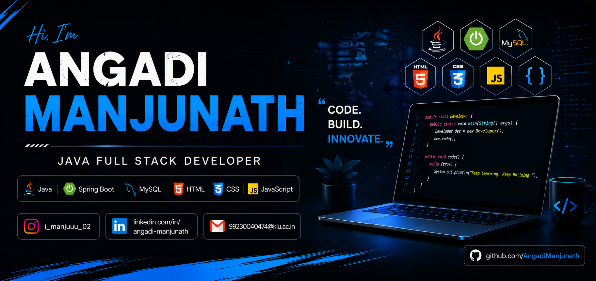

  

# 👋 Hi, I'm Angadi Manjunath

💻 Java Full Stack Developer  
🌱 Currently learning Spring Boot & DSA  
🚀 Passionate about building web applications and solving coding problems

---

## 🌐 Socials:

---

# 💻 Tech Stack:

---

# 📊 GitHub Stats:

---

## 🐍 Contribution Snake

